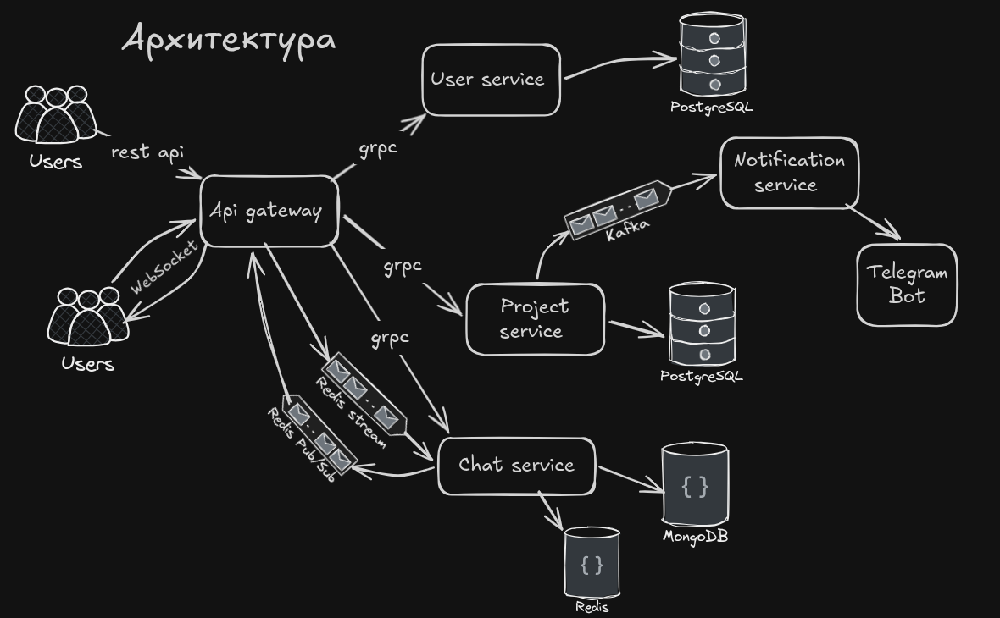
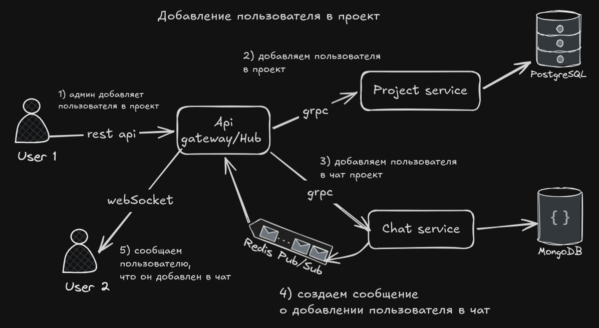
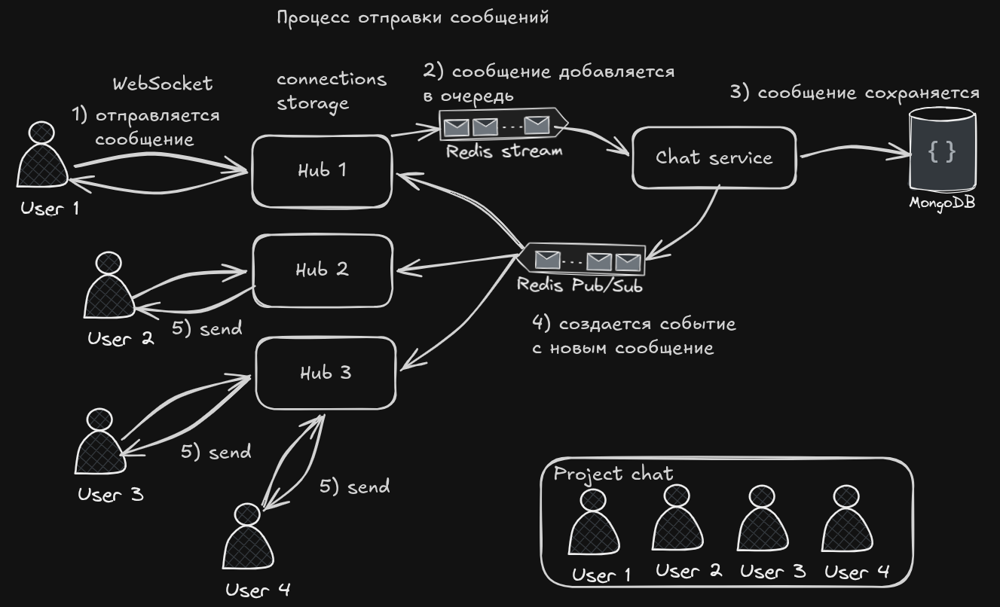

## Chat Service


Микросервис real-time чата с асинхронной обработкой сообщений, разработанный в рамках проекта **Taskly**. Обеспечивает масштабируемую архитектуру с гарантией доставки сообщений через Redis Streams и мгновенные уведомления через WebSocket.

**Важно:** Данный репозиторий содержит описание и демонстрацию работы только Chat Service. 
Остальные сервисы — часть системы Taskly.

## Оглавление

- [Chat Service](#chat-service)
- [Оглавление](#оглавление)
- [Особенности](#особенности)
- [Технологии](#технологии)
- [Архитектура](#архитектура)
- [API](#api)
  - [gRPC Methods](#grpc-methods)
  - [WebSocket Events](#websocket-events)
- [Быстрый старт](#быстрый-старт)
  - [Требования](#требования)
  - [Запуск](#запуск)
  - [Тестовый пример](#тестовый-пример)
  - [Подключение к чату](#подключение-к-чату)
  - [Отправка сообщений](#отправка-сообщений)
- [Процесс добавления пользователя в чат](#процесс-добавления-пользователя-в-чат)
- [Процесс отправки сообщений](#процесс-отправки-сообщений)


## Особенности

- **Real-time messaging** — мгновенная доставка сообщений через WebSocket

- **Guaranteed delivery** — доставка благодаря Redis Streams

- **Горизонтальная масштабируемость** — несколько инстансов Hub'ов для обработки соединений

- **Асинхронная обработка** — разделение потоков записи и чтения сообщений

- **Кеширование** — Redis для хранения часто используемых данных

- **Микросервисная архитектура** — gRPC для межсервисного взаимодействия

## Технологии 

 Стек технологий, используемых в chat service

- **Go** - основной язык программирования
- **gRPC** - общение между микросервисами.
- **MongoDB** - хранилище данных
- **Redis** 
  - Redis Streams — гарантия доставки сообщений
  - Redis Pub/Sub — мгновенная рассылка между Hub'ами
  - Redis Cache — хранение активных соединений

## Архитектура



- **Api Gateway** - проксирует запросы между клиентами и микросервисами, хранит WebSocket соединения

- **User Service** - хранит данные пользователей, управляет процессов аутентификации и авторизации

- **Project Service** - хранит данные проектов, управляет процессами создания и удаления. Работает с задачами, которые связаны с проектами. Отправляет уведомления о изменениях в проекте через Kafka

- **Notification Service** - принимает уведомления от Kafka и отправляет их пользователю через телеграм бота

- **Chat Service** - работает с чатами, историей чатов. Обрабатывает новые сообщения через Redis Streams и отправляет их через Redis Pub/Sub

## API

### gRPC Methods

Proto файл доступен по [./chat-service/api/chat_v1/chat.proto](./chat-service/api/chat_v1/chat.proto)

Основные методы:

| Service | Method | Description |
| --- | --- | --- |
| ChatService | CreateChat | Создание чата |
| ChatService | AddUserToChat | Добавление пользователя в чат |
| ChatService | RemoveUserFromChat | Удаление пользователя из чата |
| ChatService | GetChat | Получение чата |
| ChatService | GetUserChats | Получение чатов пользователя |
| ChatService | GetMessages | Получение истории чата |

### WebSocket Events

| Event | Description | Direction | Payload |
| --- | --- | --- | --- |
| `message:new` | Отправка нового сообщения | Client -> Server | `room_id, content` |
| `message:received` | Получение нового сообщения | Server -> Client | `type, room_id, content, user_id, time` |
| `update:user_added` | Добавление пользователя в чат | Server -> Client | `type, user_id, room_id` |
| `update:user_removed` | Удаление пользователя из чата | Server -> Client | `type, user_id, room_id` |

## Быстрый старт

### Требования
- Go 1.21+
- Docker & Docker Compose

### Запуск

```bash
# Клонируйте репозиторий
git clone https://github.com/apple5343/chat-service.git
cd chat-service

# Запустите инфраструктуру
docker compose --env-file ./example.env up -d
```

После запуска инфраструктуры, проект доступен по адресу http://localhost:8090.

### Тестовый пример

Скрипт `example/main.go` демонстрирует базовый workflow:

1. **Регистрирует 5 пользователей** (user1@example.com ... user5@example.com)
2. **Авторизует каждого пользователя** и получает access tokens
3. **Создает 2 проекта:**
   - Project 1: admin=user1, участники=[user1, user2, user3]
   - Project 2: admin=user1, участники=[user1, user4, user5]
4. **Выводит информацию** о созданных пользователях и проектах

После запуска вы увидите ID пользователей и проектов, которые можно использовать для тестирования чата.

```bash
go run example/main.go
```

### Подключение к чату

Рекомендую использовать Postman.

Для подключения к чатам, используйте следующий URL: `ws://localhost:8090/api/chats/ws`. С заголовком `Authorization: Bearer <access_token>`

Теперь вы можете отправлять и получать сообщения.

### Отправка сообщений

Для отправки сообщения в чат по WebSocket, нужно использовать следующуй JSON-объект:

```json
{
  "room_id": "<room_id>",
  "content": "<message>"
}
```


## Процесс добавления пользователя в чат



1. Пользователь отправляет запрос на добавление в проект
2. Api Gateway отправляет запрос в Project Service
3. Project Service отправляет запрос в Chat Service
4. Chat Service отправляет сообщение в Redis Pub/Sub о добавлении пользователя в чат проекта
5. Hub получает сообщение из Redis Pub/Sub и отправляет его пользователю через WebSocket
   
## Процесс отправки сообщений



1. Пользователь отправляет сообщение через WebSocket
2. Api Gateway отправляет запрос в Chat Service через Redis Streams
3. Chat Service сохраняет сообщение в БД
4. Chat Service отправляет сообщение в Redis Pub/Sub
5. Каждый инстанс Hub получает сообщение из Redis Pub/Sub, проверяет с какими пользователями он связан и отправляет его через WebSocket