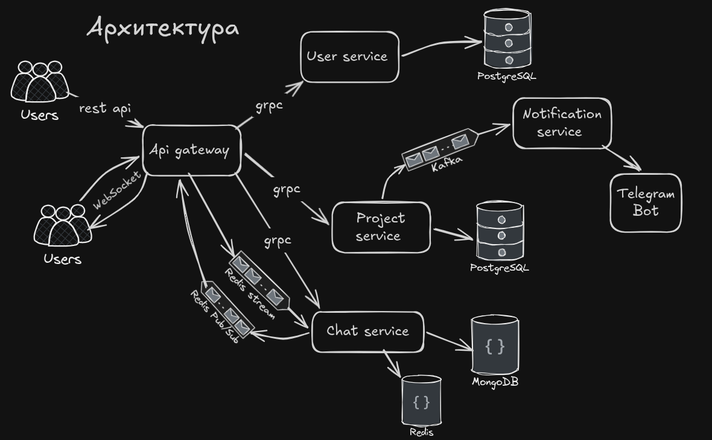
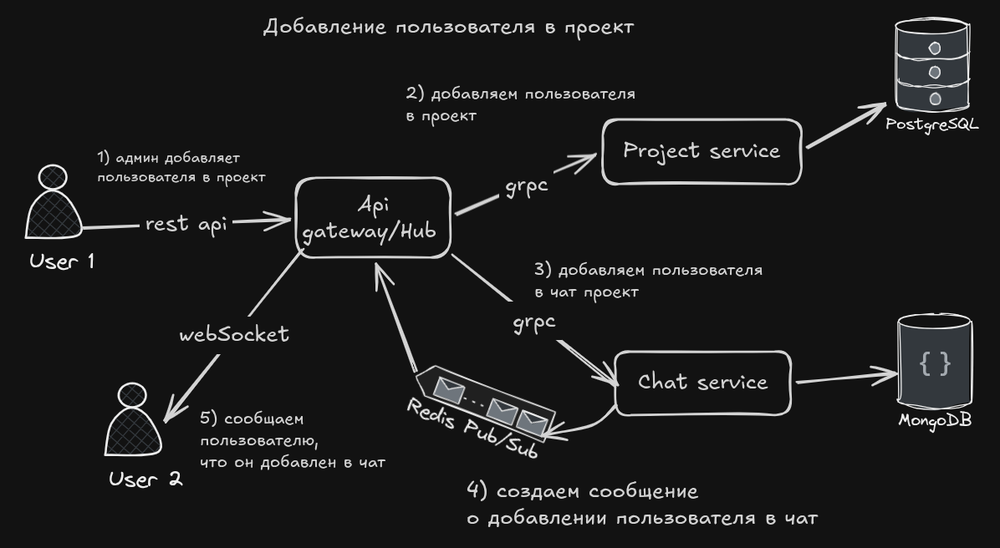
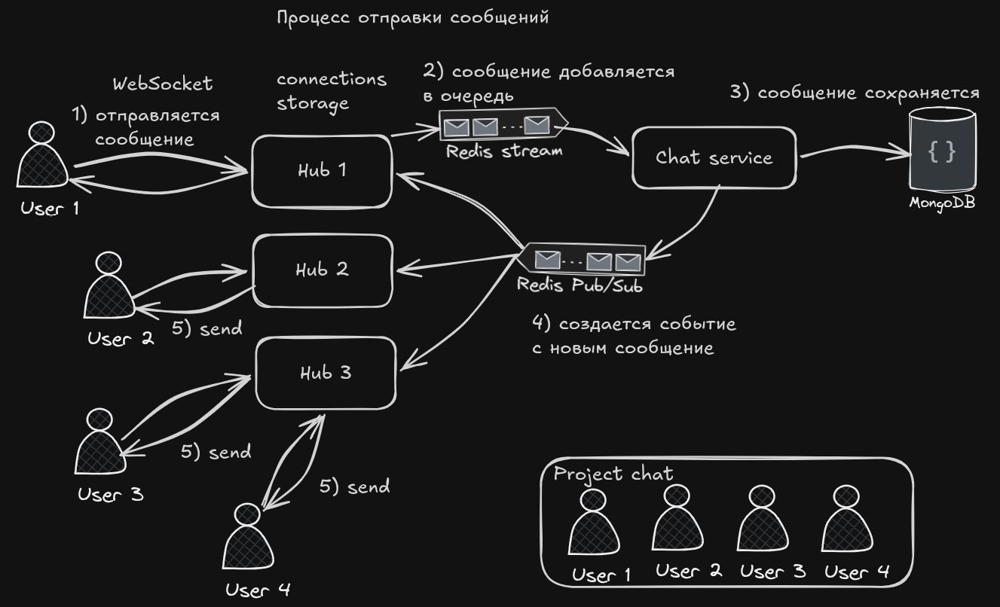

## Chat Service

Микросервис real-time чата с асинхронной обработкой сообщений, разработанный в рамках проекта **Taskly**. Обеспечивает масштабируемую архитектуру с гарантией доставки сообщений через Redis Streams и мгновенные уведомления через WebSocket.

**Важно:** данный репозиторий содержит описание и демонстрацию работы только Chat Service. Остальные сервисы — часть системы Taskly.

## Оглавление

- [Chat Service](#chat-service)
- [Оглавление](#оглавление)
- [Особенности](#особенности)
- [Технологии](#технологии)
- [Архитектура](#архитектура)
- [API](#api)
  - [gRPC Methods](#grpc-methods)
  - [WebSocket Events](#websocket-events)
- [Быстрый старт](#быстрый-старт)
  - [Требования](#требования)
  - [Запуск](#запуск)
  - [Тестовый пример](#тестовый-пример)
  - [Подключение к чату](#подключение-к-чату)
  - [Отправка сообщений](#отправка-сообщений)
- [Процесс добавления пользователя в чат](#процесс-добавления-пользователя-в-чат)
- [Процесс отправки сообщений](#процесс-отправки-сообщений)
- [Тестирование](#тестирование)
  - [Unit-тесты](#unit-тесты)
  - [Интеграционные тесты](#интеграционные-тесты)
  - [Структура тестов](#структура-тестов)

## Особенности

- **Real-time messaging** — мгновенная доставка сообщений через WebSocket
- **Guaranteed delivery** — доставка гарантирована за счёт Redis Streams
- **Горизонтальная масштабируемость** — несколько инстансов Hub для обработки соединений
- **Асинхронная обработка** — раздельные потоки записи и чтения сообщений
- **Кеширование** — Redis для хранения часто используемых данных
- **Микросервисная архитектура** — gRPC для межсервисного взаимодействия

## Технологии

- **Go** — основной язык разработки
- **gRPC** — межсервисное взаимодействие
- **MongoDB** — хранилище данных
- **Redis**
  - Redis Streams — гарантия доставки сообщений
  - Redis Pub/Sub — мгновенная рассылка между инстансами Hub
  - Redis Cache — хранение активных соединений

## Архитектура



- **API Gateway** — проксирует запросы между клиентами и микросервисами, хранит WebSocket-соединения
- **User Service** — хранит данные пользователей, управляет аутентификацией и авторизацией
- **Project Service** — хранит данные проектов, управляет их созданием и удалением, работает с привязанными к проектам задачами; отправляет уведомления об изменениях в проекте через Kafka
- **Notification Service** — принимает уведомления из Kafka и доставляет их пользователю через Telegram-бота
- **Chat Service** — работает с чатами и историей сообщений; обрабатывает новые сообщения через Redis Streams и рассылает их через Redis Pub/Sub

## API

### gRPC Methods

Proto-файл: [./chat-service/api/chat_v1/chat.proto](./chat-service/api/chat_v1/chat.proto)

Основные методы:

| Service | Method | Description |
| --- | --- | --- |
| ChatService | CreateChat | Создание чата |
| ChatService | AddUserToChat | Добавление пользователя в чат |
| ChatService | RemoveUserFromChat | Удаление пользователя из чата |
| ChatService | GetChat | Получение чата |
| ChatService | GetUserChats | Получение чатов пользователя |
| ChatService | GetMessages | Получение истории чата |

### WebSocket Events

| Event | Description | Direction | Payload |
| --- | --- | --- | --- |
| `message:new` | Отправка нового сообщения | Client → Server | `room_id, content` |
| `message:received` | Получение нового сообщения | Server → Client | `type, room_id, content, user_id, time` |
| `update:user_added` | Добавление пользователя в чат | Server → Client | `type, user_id, room_id` |
| `update:user_removed` | Удаление пользователя из чата | Server → Client | `type, user_id, room_id` |

## Быстрый старт

### Требования

- Go 1.21+
- Docker & Docker Compose

### Запуск

```bash
# Клонируйте репозиторий
git clone https://github.com/apple5343/chat-service.git
cd chat-service

# Запустите инфраструктуру
docker compose --env-file ./example.env up -d
```

После запуска инфраструктуры проект доступен по адресу http://localhost:8090.

### Тестовый пример

Скрипт `example/main.go` демонстрирует базовый workflow:

1. **Регистрирует 5 пользователей** (user1@example.com … user5@example.com)
2. **Авторизует каждого пользователя** и получает access-токены
3. **Создаёт 2 проекта:**
   - Project 1: admin=user1, участники=[user1, user2, user3]
   - Project 2: admin=user1, участники=[user1, user4, user5]
4. **Выводит информацию** о созданных пользователях и проектах

После запуска вы увидите ID пользователей и проектов, которые можно использовать для тестирования чата.

```bash
go run example/main.go
```

### Подключение к чату

Рекомендую использовать Postman.

Для подключения к чату используйте URL `ws://localhost:8090/api/chats/ws` с заголовком `Authorization: Bearer <access_token>`.

После этого можно отправлять и получать сообщения.

### Отправка сообщений

Для отправки сообщения через WebSocket используйте следующий JSON:

```json
{
  "room_id": "<room_id>",
  "content": "<message>"
}
```

## Процесс добавления пользователя в чат



1. Пользователь отправляет запрос на добавление в проект
2. API Gateway передаёт запрос в Project Service
3. Project Service передаёт запрос в Chat Service
4. Chat Service публикует в Redis Pub/Sub сообщение о добавлении пользователя в чат проекта
5. Hub получает сообщение из Redis Pub/Sub и отправляет его пользователю через WebSocket

## Процесс отправки сообщений



1. Пользователь отправляет сообщение через WebSocket
2. API Gateway передаёт его в Chat Service через Redis Streams
3. Chat Service сохраняет сообщение в БД
4. Chat Service публикует сообщение в Redis Pub/Sub
5. Каждый инстанс Hub получает сообщение из Redis Pub/Sub, проверяет, с какими пользователями он связан, и отправляет его через WebSocket

## Тестирование

Проект содержит unit- и интеграционные тесты.

### Unit-тесты

Покрывают все gRPC-методы: `CreateChat`, `AddUserToChat`, `RemoveUserFromChat`, `GetChat`, `GetUserChats`, `GetMessages`, `GetChatUsers`.

Используют [gomock](https://github.com/golang/mock) для мокирования зависимостей. Проверяют как happy path, так и ошибки (пустые аргументы, `NotFound`, `Forbidden`).

```bash
cd chat-service
go test -v ./test/unit/...
```

### Интеграционные тесты

Проверяют работу сервиса с реальными Redis и MongoDB через [testcontainers-go](https://github.com/testcontainers/testcontainers-go).

Тесты организованы в suites (`ChatSuite`, `UserSuite`, `MessageSuite`) с общей инициализацией в `BaseTestSuite`:

- перед каждым тестом данные в MongoDB и Redis очищаются, контейнер сервиса перезапускается
- асинхронные операции проверяются через `require.Eventually`

```bash
cd chat-service
go test -v ./test/integration/...
```

### Структура тестов

```
test/
├── unit/           # Unit-тесты с моками
│   ├── create_chat_test.go
│   ├── add_user_test.go
│   ├── remove_user_test.go
│   ├── get_chat_test.go
│   ├── get_chat_users_test.go
│   ├── get_messages_test.go
│   └── get_user_chats_test.go
└── integration/    # Интеграционные тесты с testcontainers
    ├── init_test.go
    ├── chat_test.go
    ├── user_test.go
    ├── message_test.go
    ├── grpc/       # gRPC-клиент
    ├── redis/      # Redis-клиент
    └── mongo/      # MongoDB-клиент
```
